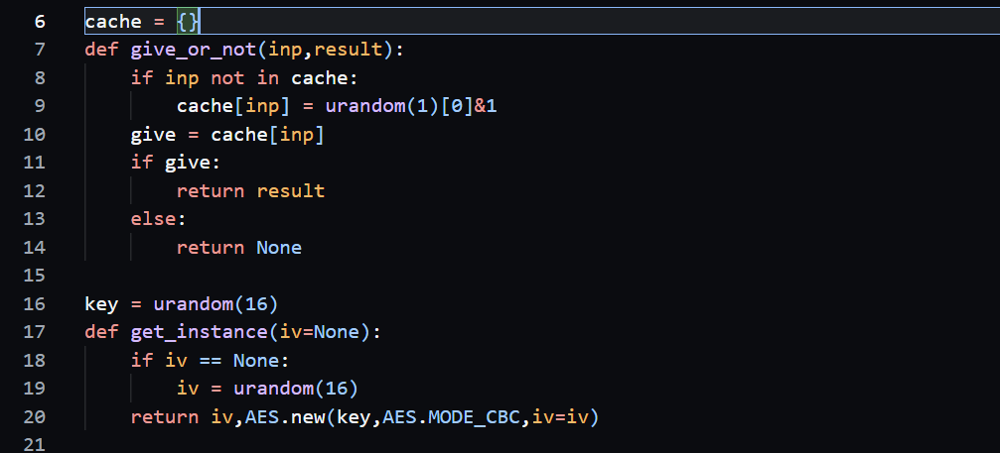
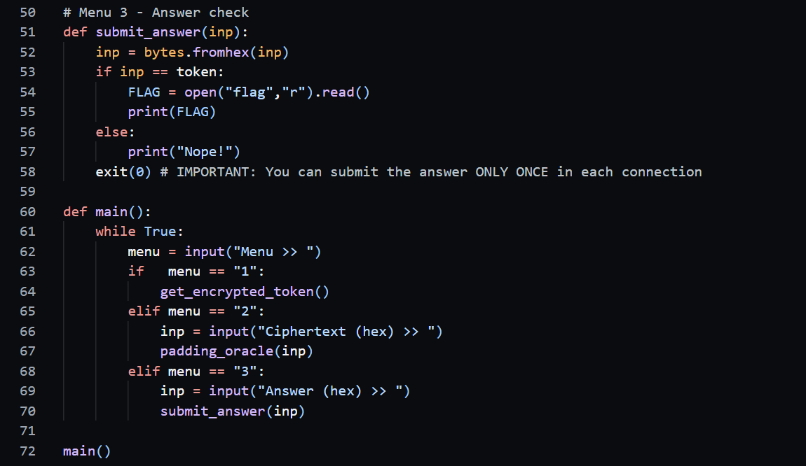
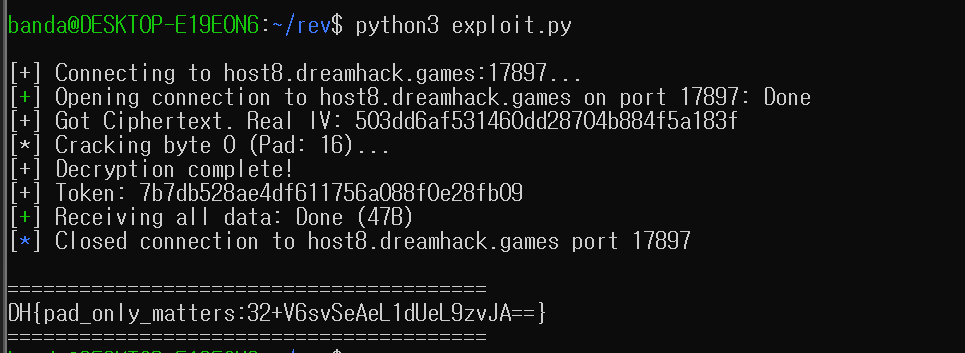

## Explain

해당 문제는 `.py` 파일만이 제공되는 Crypto 문제다.
요약하자면, AES-CBC 암호화 모드에서 발생하는 Padding Oracle Attack 취약점을 이용하여, 암호화된 Token을 복호화하고 플래그를 획득하는 문제다.

먼저 어떤 입력(`inp`)이 들어오면 50% 확률로 `result`(True/False)를 알려주고, 50% 확률로 `None`을 반환한다. 


복호화된 결과의 패딩이 올바르면 True, 틀리면 False를 반환한다. 전형적인 Padding Oracle Attack 취약점이다. 공격자는 이를 이용해 암호화 키를 몰라도 평문을 복구할 수 있게 된다.



AES-CBC 모드에서 복호화 과정은 다음과 같다.

$$P_i = D_K(C_i) \oplus C_{i-1}$$

(여기서 $P$는 평문, $D_K$는 복호화 함수, $C_{i-1}$은 직전 암호문 블록)
우리가 서버에 변조된 IV($IV'$)를 보내면 서버는 다음과 같이 계산하여 패딩을 확인한다.

$$P' = D_K(C_i) \oplus IV'$$

$P'$의 끝부분이 올바른 패딩값(`0x01`, `0x02 0x02`, ...)이 되도록 $IV'$를 조작하면, $D_K(C_i)$라는 중간값 을 알아낼 수 있게 되고 이걸 이용하면 된다.


## Payload
```python
from pwn import *
import sys
import time
HOST = 'host8.dreamhack.games' 
PORT = 17897 

def solve():
    while True:
        try:
            print(f"\n[+] Connecting to {HOST}:{PORT}...")
            r = remote(HOST, PORT)
            
            r.sendlineafter(b'Menu >> ', b'1')
            response = r.recvline().strip().decode()
            
            if len(response) != 96:
                print("[-] Invalid response length. Retrying...")
                r.close()
                continue
                
            real_iv = bytes.fromhex(response[:32])
            target_ct = bytes.fromhex(response[32:64]) # Token Block
            
            print(f"[+] Got Ciphertext. Real IV: {real_iv.hex()}")
            
            intermediate = bytearray(16)
            failed_session = False
            for byte_index in range(15, -1, -1):
                padding_value = 16 - byte_index
                
                sys.stdout.write(f"\r[*] Cracking byte {byte_index} (Pad: {padding_value})... ")
                sys.stdout.flush()
                
                found_byte = False
                
                base_iv = bytearray(16)
                for k in range(byte_index + 1, 16):
                    base_iv[k] = intermediate[k] ^ padding_value
                
                # 0x00 ~ 0xFF 브루트포스
                for val in range(256):
                    base_iv[byte_index] = val
                    
                    test_iv = bytearray(base_iv)
                    dummy_idx = 0
                    
                    is_valid = False
                    
                    while True:
                        payload = test_iv.hex().encode() + target_ct.hex().encode()
                        r.sendlineafter(b'Menu >> ', b'2')
                        r.sendlineafter(b'Ciphertext (hex) >> ', payload)
                        
                        res = r.recvline().strip().decode()
                        
                        if res == 'True':
                            is_valid = True
                            break
                        elif res == 'False':
                            is_valid = False
                            break
                        else: # None (Cache Hit/Drop)
                            if byte_index == 0:

                                is_valid = False 
                                break 
                            else:
                                # Byte 1~15는 IV[0]을 바꿔서 재시도
                                test_iv[dummy_idx] = (test_iv[dummy_idx] + 1) % 256
                    
                    if is_valid:
                        intermediate[byte_index] = val ^ padding_value
                        found_byte = True
                        break
                
                if not found_byte:
                    print(f"\n[-] Failed to crack byte {byte_index}. (Bad luck with 50% drop)")
                    failed_session = True
                    break
            
            if failed_session:
                print("[-] Restarting session...")
                r.close()
                continue 
            
         
            token = bytes([intermediate[i] ^ real_iv[i] for i in range(16)])
            print(f"\n[+] Decryption complete!")
            print(f"[+] Token: {token.hex()}")
            
       
            r.sendlineafter(b'Menu >> ', b'3')
            r.sendlineafter(b'Answer (hex) >> ', token.hex().encode())
            
            flag_res = r.recvall().decode()
            if "DH{" in flag_res:
                print(f"\n{'='*40}")
                print(flag_res.strip())
                print(f"{'='*40}")
                r.close()
                return
            else:
                print(f"[-] Something went wrong: {flag_res}")
                r.close()
                
        except EOFError:
            print("[-] Server disconnected unexpectedly.")
            r.close()
        except KeyboardInterrupt:
            print("\n[*] Aborted by user.")
            exit()
        except Exception as e:
            print(f"[-] Error: {e}")
            if 'r' in locals(): r.close()

if __name__ == '__main__':
    solve()
```
exploit code는 다음과 같이 작성했다.
먼저 서버에 접속하여 `Menu 1`을 통해 암호화된 토큰(IV + Ciphertext)을 받는다.
이후 15번째 바이트부터 1번째 바이트까지 역순으로 찾으면서, 0x00~0xFF를 대입해서 서버에 쿼리를 보낸다. None이 뜨면 IV의 앞부분을 바꿔서 재전송한다.
이후 캐시 우회 없이 쿼리를 보내고, flag를 찾기 이전에 중요 패킷이 None 상태가 되면 Failed를 띄우고 세션을 종료한 뒤에 재접속하도록 코드를 구성했다.

그리고 성공하면 찾아낸 중간값과 원본 IV를 XOR 하여 평문을 복구해낸다.


## Solved

결국 패딩 오라클 공격을 막기 위해 50% 확률로 패킷을 드랍하고 그 입력을 차단하는 수단을 우회하고, 약간은 운에 맡기는 문제였다.