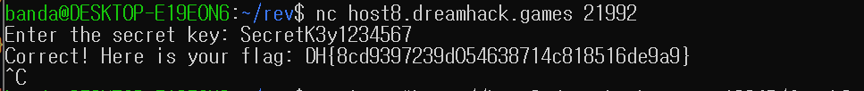

## Explain
```c
__int64 __fastcall main(int a1, char **a2, char **a3)
{
  char char128[128]; // [rsp+0h] [rbp-D0h] BYREF
  char char32_2[32]; // [rsp+80h] [rbp-50h] BYREF
  char char32[32]; // [rsp+A0h] [rbp-30h] BYREF
  FILE *stream; // [rsp+C0h] [rbp-10h]
  size_t size; // [rsp+C8h] [rbp-8h]

  setvbuf(stdin, 0, 2, 0);
  setvbuf(stdout, 0, 2, 0);
  setvbuf(stderr, 0, 2, 0);
  printf("Enter the secret key: ");
  if ( !fgets(char32, 32, stdin) )
  {
    puts("Failed to read input");
    return 1;
  }
  size = strlen(char32);
  if ( size && char32[size - 1] == 10 )
    char32[--size] = 0;
  if ( size != 16 )
  {
    puts("Wrong key length!");
    return 1;
  }
  sub_4011AF((__int64)char32, (__int64)char32_2, 16);
  if ( !memcmp(char32_2, &unk_404070, 0x10u) )
  {
    stream = fopen("flag", "r");
    if ( !stream )
    {
      puts("Flag file not found!");
      return 1;
    }
    if ( fgets(char128, 128, stream) )
      printf("Correct! Here is your flag: %s\n", char128);
    fclose(stream);
  }
  else
  {
    puts("Wrong key!");
  }
  return 0;
}
```
이 문제는 입력값을 변조하여 특정 데이터와 비교하는 루틴을 분석하고, 이를 리버스엔지니어링을 통해 Secret Key를 찾아내는 문제라고 파악했다.

먼저 IDA를 통해 문제를 확인해보면 우리가 찾아야 할 키는 16 바이트다. 입력값 char32를 sub_4011AF 함수에 넣어서 변환하고, 그 결과를 char 32_2에 저장한다. 정방향 연산: Nibble Swap → XOR → 덧셈 연산을 했다는 식으로 이해하면 된다.

```c
if ( !memcmp(char32_2, &unk_404070, 0x10u) )
```
특히 이 부분이 중요한데, 변환된 값 char32_2가 메모리에 하드코딩되어있는 정답 데이터인 unk_404070과 똑같아야 한다. 즉, unk_404070이 암호화된 정답이라는 것을 알 수 있다.

# payload
```python
from pwn import *

# 1. 서버 연결 정보 설정
r = remote('host8.dreamhack.games', 21992)

# 2. Secret Key 복구 (아까 짠 로직)
encrypted_data = [
    0x6F, 0x0D, 0x6E, 0x80, 
    0x10, 0x22, 0xF4, 0x70, 
    0xD5, 0x52, 0x83, 0x74, 
    0x25, 0x16, 0x47, 0x38
]

key = ""
for i in range(16):
    target_byte = encrypted_data[i]
    step1 = (target_byte - i) % 256
    step2 = step1 ^ 0x5A
    final_char = ((step2 >> 4) | (step2 << 4)) & 0xFF
    key += chr(final_char)

print(f"[*] Recovered Key: {key}")

r.sendlineafter(b': ', key.encode())
r.interactive()
```
payload 파일에 있는 encrypted_data에 들어가있는 리스트가 바로 IDA를 통해 바이너리 파일 내부의 unk_404070 주소에 있는 값들을 넣어준 것이다.

또한 기존의 연산 과정인 `Nibble Swap`, `XOR 0x5A`, `Add Index`를 역연산하는 파이썬 스크립트를 작성해줬다.

# Solve

스크립트가 계산한 Secret Key를 서버에 전송하면 플래그를 획득할 수 있다.